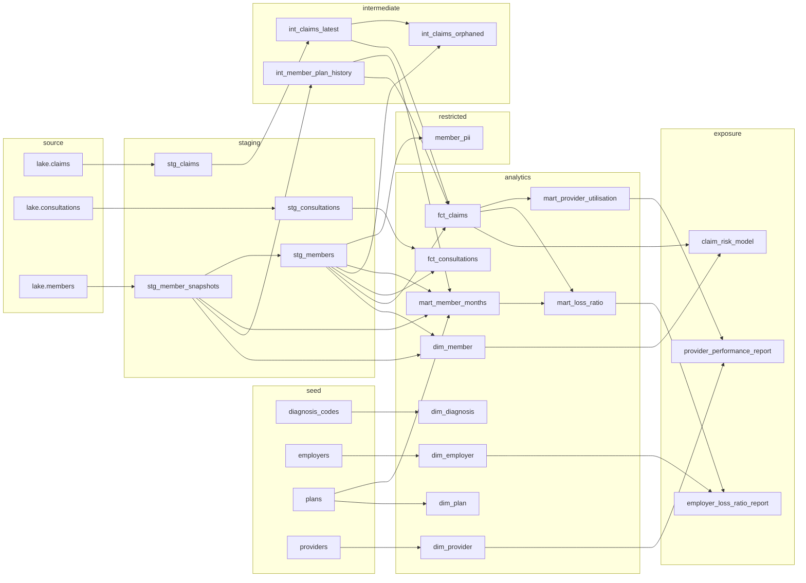

# Lineage

Generated from dbt's manifest by `python -m claims.lineage diagram`.

```mermaid
flowchart LR
  subgraph source
    source_claims_lake_claims["lake.claims"]
    source_claims_lake_consultations["lake.consultations"]
    source_claims_lake_members["lake.members"]
  end
  subgraph seed
    seed_claims_diagnosis_codes["diagnosis_codes"]
    seed_claims_employers["employers"]
    seed_claims_plans["plans"]
    seed_claims_providers["providers"]
  end
  subgraph staging
    model_claims_stg_claims["stg_claims"]
    model_claims_stg_consultations["stg_consultations"]
    model_claims_stg_member_snapshots["stg_member_snapshots"]
    model_claims_stg_members["stg_members"]
  end
  subgraph intermediate
    model_claims_int_claims_latest["int_claims_latest"]
    model_claims_int_claims_orphaned["int_claims_orphaned"]
    model_claims_int_member_plan_history["int_member_plan_history"]
  end
  subgraph restricted
    model_claims_member_pii["member_pii"]
  end
  subgraph analytics
    model_claims_dim_diagnosis["dim_diagnosis"]
    model_claims_dim_employer["dim_employer"]
    model_claims_dim_member["dim_member"]
    model_claims_dim_plan["dim_plan"]
    model_claims_dim_provider["dim_provider"]
    model_claims_fct_claims["fct_claims"]
    model_claims_fct_consultations["fct_consultations"]
    model_claims_mart_loss_ratio["mart_loss_ratio"]
    model_claims_mart_member_months["mart_member_months"]
    model_claims_mart_provider_utilisation["mart_provider_utilisation"]
  end
  subgraph exposure
    exposure_claims_claim_risk_model["claim_risk_model"]
    exposure_claims_employer_loss_ratio_report["employer_loss_ratio_report"]
    exposure_claims_provider_performance_report["provider_performance_report"]
  end
  model_claims_dim_employer --> exposure_claims_employer_loss_ratio_report
  model_claims_dim_member --> exposure_claims_claim_risk_model
  model_claims_dim_provider --> exposure_claims_provider_performance_report
  model_claims_fct_claims --> exposure_claims_claim_risk_model
  model_claims_fct_claims --> model_claims_mart_loss_ratio
  model_claims_fct_claims --> model_claims_mart_provider_utilisation
  model_claims_int_claims_latest --> model_claims_fct_claims
  model_claims_int_claims_latest --> model_claims_int_claims_orphaned
  model_claims_int_member_plan_history --> model_claims_fct_claims
  model_claims_int_member_plan_history --> model_claims_mart_member_months
  model_claims_mart_loss_ratio --> exposure_claims_employer_loss_ratio_report
  model_claims_mart_member_months --> model_claims_mart_loss_ratio
  model_claims_mart_provider_utilisation --> exposure_claims_provider_performance_report
  model_claims_stg_claims --> model_claims_int_claims_latest
  model_claims_stg_consultations --> model_claims_fct_consultations
  model_claims_stg_member_snapshots --> model_claims_dim_member
  model_claims_stg_member_snapshots --> model_claims_int_member_plan_history
  model_claims_stg_member_snapshots --> model_claims_mart_member_months
  model_claims_stg_member_snapshots --> model_claims_stg_members
  model_claims_stg_members --> model_claims_dim_member
  model_claims_stg_members --> model_claims_fct_claims
  model_claims_stg_members --> model_claims_fct_consultations
  model_claims_stg_members --> model_claims_int_claims_orphaned
  model_claims_stg_members --> model_claims_mart_member_months
  model_claims_stg_members --> model_claims_member_pii
  seed_claims_diagnosis_codes --> model_claims_dim_diagnosis
  seed_claims_employers --> model_claims_dim_employer
  seed_claims_plans --> model_claims_dim_plan
  seed_claims_plans --> model_claims_mart_member_months
  seed_claims_providers --> model_claims_dim_provider
  source_claims_lake_claims --> model_claims_stg_claims
  source_claims_lake_consultations --> model_claims_stg_consultations
  source_claims_lake_members --> model_claims_stg_member_snapshots
```
